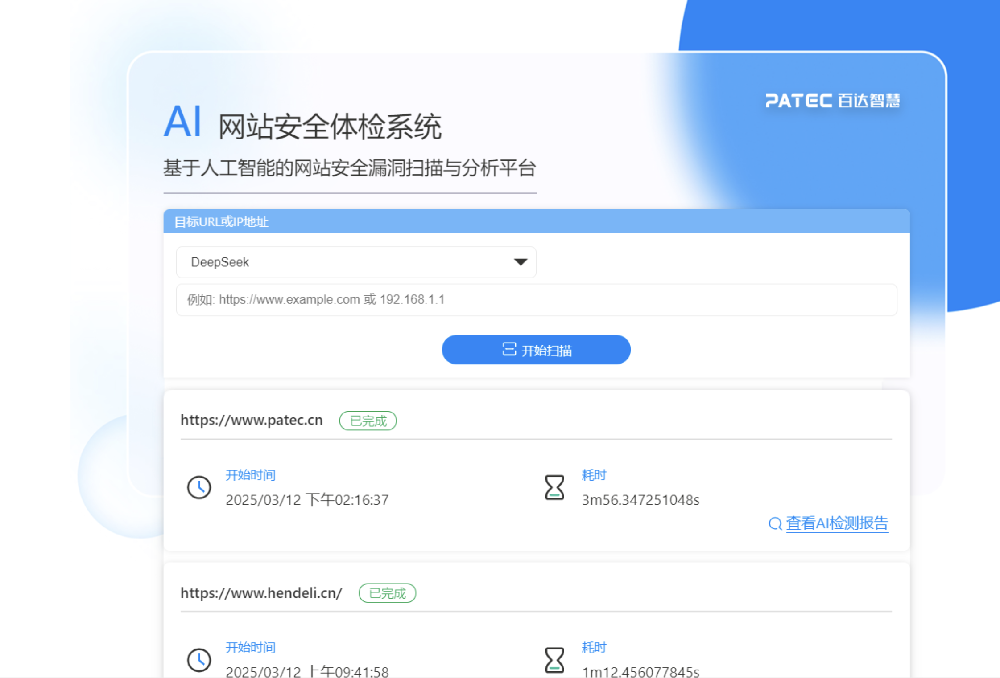

# aiwebcheck
AI网站体检系统，ai网站渗透测试系统

#AI网站安全体检系统使用指南
本系统采用先进的AI技术，支持腾讯混元和DeepSeek两种大模型，为您的网站提供全面的安全检测服务。
🚀 快速开始
只需输入目标网址，选择合适的AI模型，即可开始安全扫描。系统支持批量任务，最多同时运行5个扫描任务。

🤖 智能分析
腾讯混元模型速度快捷，适合快速检测；DeepSeek模型分析更深入，适合深度安全评估。

📊 实时监控
任务进度实时展示，可随时查看扫描状态，支持手动停止正在运行的任务。

使用步骤
在输入框中输入目标网站URL（例如：https://example.com）或IP地址
从下拉菜单选择AI模型：
腾讯混元：响应速度快，适合快速扫描
DeepSeek：分析更深入，但耗时较长
点击"开始扫描"按钮启动检测
等待扫描完成，查看分析报告
注意事项
请确保输入的URL格式正确，系统会自动过滤危险字符
任务队列最多支持5个并发任务，超出将自动排队
扫描过程中可以通过右上角"×"按钮随时停止任务
建议定期对重要系统进行安全扫描
如未发现漏洞，可稍后使用不同模型重新扫描
